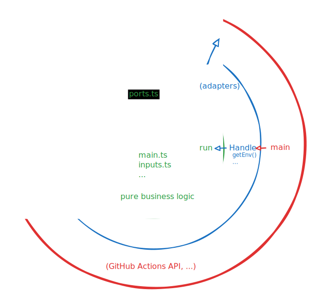

# Contributing guide

Contributions are more than welcome!

We label issues that we think should be easy for first-time contributors with
[`good-first-issue`](https://github.com/lumen-oss/gh-actions-lux/issues?q=is%3Aissue%20state%3Aopen%20label%3A%22good%20first%20issue%22).

This document assumes that you already know how to use GitHub and Git. If that's
not the case, we recommend learning about it first
[here](https://docs.github.com/en/get-started/quickstart/hello-world).

## AI Policy

We don't mind if you use AI to assist your development. But we expect you to
understand everything that is generated and to validate and clean up the
generated code.

Reviewing AI generated code that has not been validated or cleaned up takes up
more time for us than just writing the code ourselves.

We will close your pull request without further consideration if:

- We ask you a question about your code and you cannot explain it.
- Change requests are repeatedly ignored by your AI agent.
- We find that you have not cleaned up the generated code (e.g., if there are
  lots of useless comments).

## Creating pull requests

Please ensure your pull request title conforms to
[Conventional Commits](https://www.conventionalcommits.org/en/v1.0.0/), as they
may end up in our [generated changelog](./CHANGELOG.md).

> [!TIP]
>
> Look at our commit history for some examples for conventional commit prefixes
> and scopes we've used.

## Architecture

This repository uses the
[universal architecture](https://fullstackradio.com/38).

In short:

- The core business logic is pure, i.e. does no real IO - the "happy zone". An
  example for this is `src/inputs.ts`.
- Pure interfaces to IO actions live in `src/ports.ts`.
- Adapters to the real world live in the "demilitarized zone" (`src/io/*.ts`).
  These adapters implement the adapters in `src/ports.ts`. The implementations
  are private and instantiated via factory functions.
- Core business logic never uses IO directly, only via pure interfaces. This
  allows us to mock the interfaces with pure implementations (no IO) in our
  tests, without having to mock the entirety of the real world.
- The entrypoint, which provides access to all the adapters (via their
  interfaces), is the `Handle` interface.

<h1 align="center">
   
  
   
</h1>

## Development

This repository provides a Nix flake with a devShell that provides all the tools
you need.

### Building

Run `npm run all` to run tests, formatters, and to compile to JavaScript.

### Testing

We value proof of functionality in the form of automated tests. For that, we
rely on

- Unit tests, in a `__tests__` directory.
- Integration tests in `.github/workflows/integration-test.yml`.

We recommend
[test driven development](https://martinfowler.com/bliki/TestDrivenDevelopment.html),
but that is up to you.
